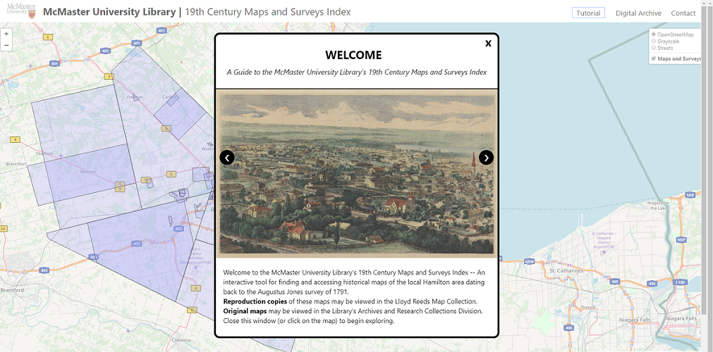

# McMaster University's 19th Century Maps and Surveys Index

**This repository is a resource to create a maps and surveys index presented as an online interactive map. Specifically, McMaster University's historical maps of the local Hamilton area dating back to the Augustus Jones survey of 1791 are showcased. Features of this map include map and survey envelopes, item preview and  description, and a tutorial modal. Access the current index [here... link to be updated!](http://perec.mcmaster.ca/maps/19thcmaps/)**

### Resource: index.html

This HTML file presents the library's 19th Century Maps and Surveys collection as an online interactive map, with features including geographical coverage, item preview and description, item citation, and a tutorial modal. This file was created using QGIS' web map functionality, along with the Leaflet library for mobile-friendly interactive maps. All JavaScript, CSS, and image files used within the HTML document are contained within the same folder. The latest version of index.html can be found online [here,... link to be updated!](http://perec.mcmaster.ca/maps/19thcmaps/) through the McMaster University Library website.

## Folder: Maps and Surveys

### Resource: hamilton_19thc_bounds_ordered.dbf

This is a Shapefile dataset for 19th century maps and surveys containing the boundaries available as polygons, the Macrepo ID of each item, and its RMC number. In addition, the boundaries have been rendered to arrange polygon layers into appropriate clickable layers using QGIS functions.

### Resource: metadata_forleaflet.txt

This is a text file containing selected metadata for 19th century maps and surveys. These include the item’s Macrepo ID, title, date, scale, surveyor or author, citation, thumbnail link, and digital archive link.

### _Find the complete user guide and project documentation in the Google Doc [here.](https://docs.google.com/document/d/1HAFOTWoOgAEbdTLOw045PreZTf29dYBbQ2MMvQ0TN7g/edit#heading=h.j6b3k271jd77)